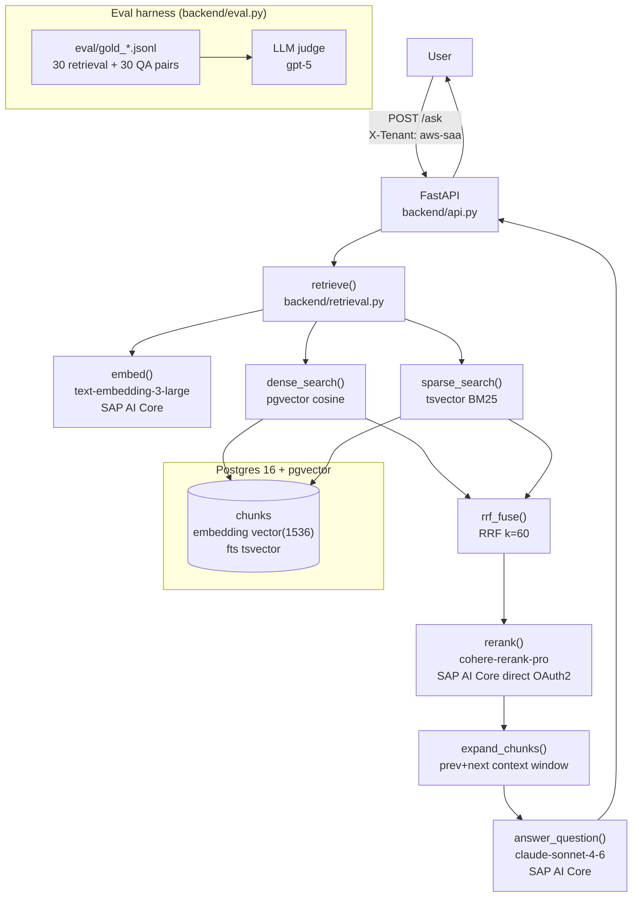

# CertCoach

Multi-tenant RAG coaching assistant for cloud certifications. Demonstrates production-grade
retrieval-augmented generation: hybrid retrieval (dense + sparse + RRF), Cohere rerank, a
first-class evaluation harness, and a measurable prompt iteration loop. Portfolio project
for AI/ML-engineer roles.

**Tenants:** AWS Solutions Architect Associate (SAA-C03) · GCP Associate Cloud Engineer · HashiCorp Terraform Associate (003).

## Architecture



## Tech Stack

| Layer | Technology |
|---|---|
| API | FastAPI 0.111, Pydantic v2 |
| Vector DB | PostgreSQL 16 + pgvector; tsvector BM25 |
| Embeddings | `text-embedding-3-large` (1536-dim) via SAP AI Core |
| Rerank | `cohere-rerank-pro` via SAP AI Core direct OAuth2 |
| Generation | `claude-sonnet-4-6` (default), swappable per request |
| Eval judge | `gpt-5` (different model family from generator) |
| Ingestion | httpx → markdownify/pdfminer → tiktoken chunking → pgvector |
| Infra | Docker Compose (Postgres + pgvector + Phoenix tracing + API + UI), Python 3.13 |

## Setup

```bash
# 1. Install
pip install -e ".[dev]"

# 2. Configure environment
cp .env.example .env
# Edit .env: AICORE_BASE_URL, AICORE_API_KEY, AICORE_DIRECT_BASE_URL,
#            AICORE_AUTH_URL, AICORE_CLIENT_ID, AICORE_CLIENT_SECRET

# 3. Ingest corpus (fetch docs first if data/ is empty)
python -m ingestion.fetch
python -m ingestion.pipeline
```

## Starting and stopping

### One-command deploy (Docker)

```bash
# Start everything — Postgres, Phoenix, API, and Streamlit UI
docker compose up --build

# Tear down (containers removed, volumes preserved)
docker compose down

# Tear down and wipe all data (clean slate before re-ingesting)
docker compose down -v
```

| Service | URL |
|---|---|
| Streamlit UI | http://localhost:8501 |
| FastAPI backend | http://localhost:8000 |
| Phoenix tracing UI | http://localhost:6006 |
| Postgres | localhost:5433 |

> **Note:** requires `.env` with AI Core credentials to be present — the `api` service loads it via `env_file`.

### Local dev (without Docker for the app)

```bash
# Start Postgres + Phoenix tracing UI only
docker compose up -d db phoenix

# Stop containers (data is preserved in Docker volumes)
docker compose stop

# Start the API (tracing off)
uvicorn backend.api:app --reload

# Start the API with Phoenix tracing enabled
PHOENIX_COLLECTOR_ENDPOINT=http://localhost:4317 uvicorn backend.api:app --reload

# Stop the API: Ctrl+C in the terminal where uvicorn is running

# Run eval
python -m backend.eval

# Run eval with Phoenix tracing
PHOENIX_COLLECTOR_ENDPOINT=http://localhost:4317 python -m backend.eval
```

Phoenix UI is at **http://localhost:6006** when running.

## API

```bash
# Ask a question
curl -X POST http://localhost:8000/ask \
  -H "X-Tenant: aws-saa" \
  -H "Content-Type: application/json" \
  -d '{"question": "What is the difference between EC2 On-Demand and Reserved Instances?"}'

# Generate a quiz
curl -X POST http://localhost:8000/quiz \
  -H "X-Tenant: gcp-ace" \
  -H "Content-Type: application/json" \
  -d '{"topic": "Cloud Storage", "n": 3}'

# Grade a learner answer
curl -X POST http://localhost:8000/grade \
  -H "X-Tenant: terraform-assoc" \
  -H "Content-Type: application/json" \
  -d '{"question": "What is a Terraform provider?", "learner_answer": "A plugin for talking to cloud APIs", "reference": "A provider is a plugin that defines resources for a specific platform."}'
```

## Eval Results

All numbers are real — run from the actual corpus, judged by `gpt-5`.
Sample sizes are small (eval harness is the focus, not scale); reported with n to be
defensible in a technical deep-dive.

### Retrieval quality (gold pairs per tenant)

| Tenant | n | recall@5 | hit@1 | mrr@10 | ndcg@5 |
|---|---|---|---|---|---|
| aws-saa | 15 | 1.000 | 0.933 | 0.956 | 0.967 |
| gcp-ace | 5 | 1.000 | 1.000 | 1.000 | 1.000 |
| terraform-assoc | 5 | 1.000 | 0.200 | 0.600 | 0.705 |

terraform-assoc hit@1 is low (0.2) because the 12-chunk corpus is small — recall@5 is perfect.
Corpus scale is the lever, not the pipeline.

### A/B retrieval comparison (aws-saa + gcp-ace + terraform-assoc, prompt v1)

| Config | recall@5 | hit@1 | mrr@10 | ndcg@5 | accuracy |
|---|---|---|---|---|---|
| dense_only | 1.000 | 0.711 | 0.856 | 0.893 | 0.710 |
| hybrid, no rerank | 1.000 | 0.756 | 0.878 | 0.910 | **0.761** |
| hybrid + rerank | 1.000 | 0.711 | 0.852 | 0.890 | 0.664 |
| hybrid + rerank + v2 | 1.000 | 0.711 | 0.852 | 0.890 | 0.708 |

`hybrid_no_rerank` beats rerank on accuracy (0.761 vs 0.664) and is ~200× faster (17ms vs 3500ms
retrieval P50). On a small corpus (~300 chunks), RRF ordering is already strong — rerank adds
latency without improving ranking quality. Adding docs would be the next lever.

### Prompt iteration (aws-saa + gcp-ace, n=20 QA pairs, judge=gpt-5)

| Prompt | aws-saa accuracy | gcp-ace accuracy |
|---|---|---|
| v1 — concise (baseline) | **0.834** | **0.745** |
| v2 — chain-of-thought | 0.804 | 0.523 |

v2 regressed. The chain-of-thought "Reasoning:" prefix shifts the answer structure
in a way the gpt-5 judge scores lower against the concise reference answers. v1 remains default.

## Honest Scope

**Built:** hybrid retrieval (dense + BM25 + RRF), Cohere rerank, expand-to-context window,
eval harness (retrieval metrics + LLM-as-judge accuracy), prompt iteration with before/after
measurement, multi-tenant isolation, 3 tenants, A/B retrieval comparison.

**Not built:** auth/accounts, streaming responses, fine-tuning, multi-node deployment,
production hardening, fancy UI.

**Not claimed:** Azure (no access). Model IDs are SAP AI Core gateway aliases.
