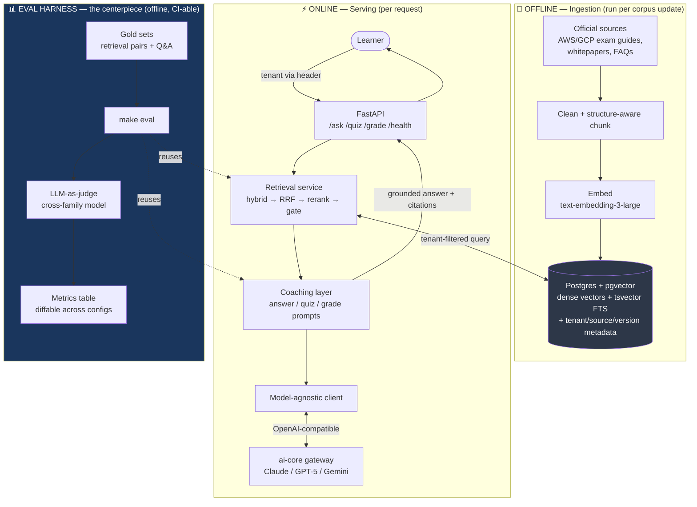
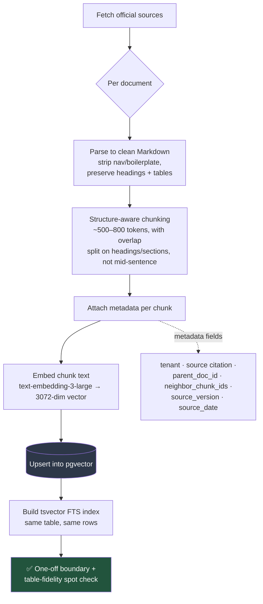
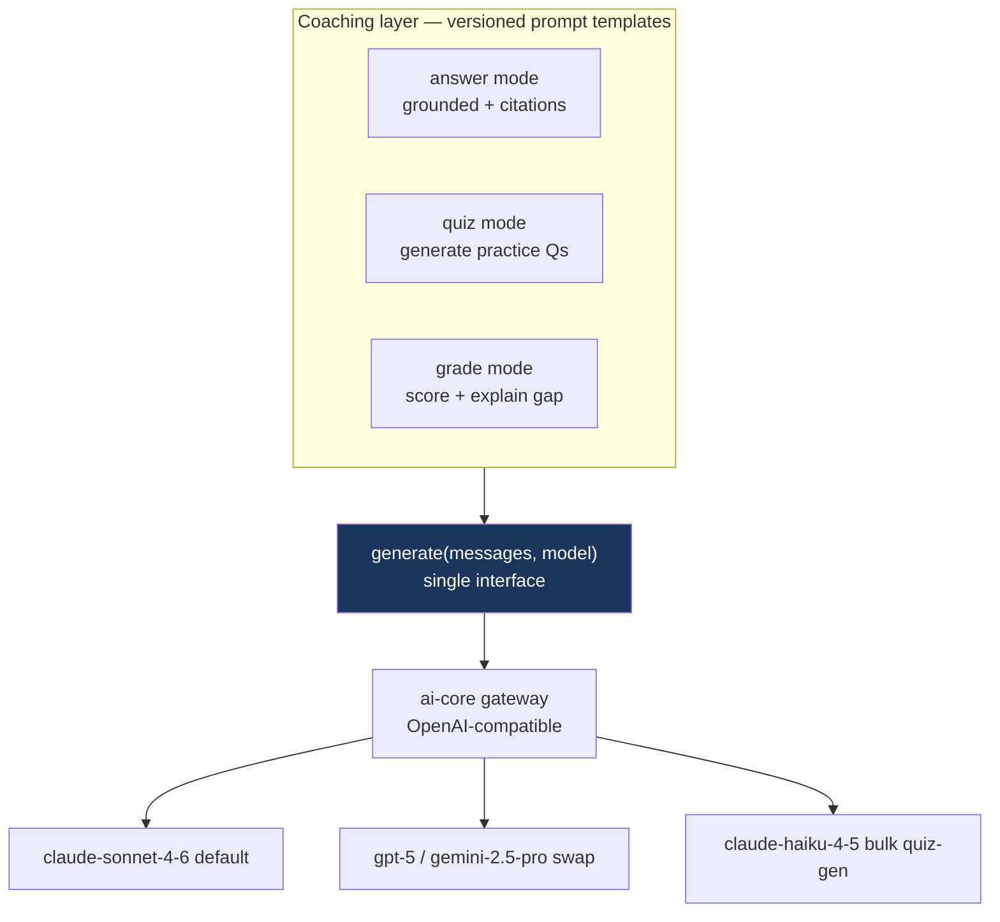
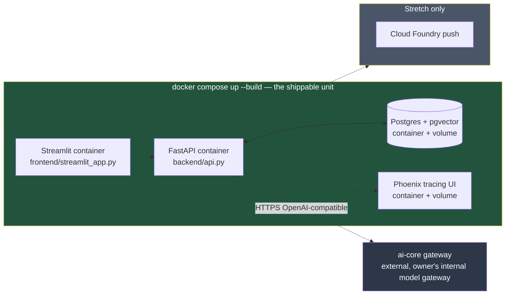

# CertCoach — End-to-End Architecture

> Companion to [`spec.md`](./spec.md). The spec records *what* we decided and *why*;
> this document explains the system *end to end* with diagrams. Cross-checked against
> current RAG best practice (sources at the bottom).
>
> **Status:** explanatory doc, tracks the approved Rev-2 design (hybrid retrieval + RRF +
> confidence gate). Update this file when the architecture changes.

---

## 1. The big picture

CertCoach has **two lifecycles that share one store**: an *offline ingestion pipeline*
(run once per corpus update) and an *online serving path* (per request). The vector store —
Postgres + pgvector — is the seam between them. This separation is deliberate: ingestion is
slow, batchy, and idempotent; serving is fast and stateless.



**Key idea:** the eval harness is not a separate test suite bolted on — it *reuses the exact
retrieval and coaching components the serving path uses*, just driven by gold sets instead of
live users. That is what makes "before/after prompt iteration" numbers credible.

---

## 2. Document preprocessing (ingestion pipeline)

Retrieval quality is won or lost here. **Garbage chunks → garbage retrieval, no reranker saves you.**



**Steps, in order:**

1. **Fetch & clean.** AWS SA-Associate exam guide + selected whitepapers/FAQs; GCP ACE exam
   guide + docs — **first-party vendor docs only, enumerated in `ingestion/sources.yaml`; fetched
   into gitignored `data/`, no third-party exam dumps (see spec §8).** Strip HTML nav/footers. The
   hard part is **preserving structure** — headings
   and tables carry meaning in cert docs (e.g. a service-comparison table). The "table-fidelity
   spot check" exists because naive parsers flatten tables into word soup. **Output format: Markdown**
   — every source (HTML *and* PDF) is normalized to clean Markdown here, which is what the
   structure-aware chunker (step 2) splits on and what the LLM reads at answer time. (PDF and plain
   text are worse to chunk: PDF flattens tables/columns; plain text discards the headings you split on.)
2. **Paragraph-aware chunking (~650 tokens, with 100-token overlap).** Slide a 650-token window and snap cuts to the last `\n{2,}` paragraph boundary within the window (if it leaves ≥50 tokens). This avoids splitting mid-sentence. Overlap (~15%) prevents a boundary-straddling answer from being cut in half.
3. **Metadata is the multi-tenancy AND the citations.** Every chunk row stores:
   - `tenant` → isolation boundary (AWS vs GCP), filtered on *every* query.
   - `source` → citations ("AWS Well-Architected, Security Pillar, p.12").
   - `parent_doc_id` + `neighbor_chunk_ids` → **retrieve-small-expand-to-context**: match a tight
     chunk, then hand the LLM surrounding neighbors for room to reason.
   - `source_version` / `source_date` → version-aware citations (cloud docs change).
4. **Embed + dual-index.** Embed chunk text with `text-embedding-3-large`, store the vector.
   Then build a Postgres `tsvector` full-text index over the *same rows*. Dense and sparse
   retrieval live in **one store** — no second system (no Elasticsearch) to operate.

> **Optional enhancement — Contextual Retrieval (Anthropic).** Before embedding each chunk,
> prepend a 1–2 sentence LLM-generated context blurb ("This chunk is from the AWS VPC section,
> explaining subnet CIDR sizing"). Anthropic measured ~35% retrieval-failure reduction alone,
> ~49% combined with BM25. Costs one cheap LLM call per chunk at ingestion (use
> `claude-haiku-4-5`). Optional for the 2-week budget, but a strong, honest "I tried and measured
> it" eval story.

---

## 3. Retrieval (hybrid pipeline)

The Rev-2 design. This is the diagram to know for a deep-dive.

```mermaid
flowchart LR
    Q[query + tenant] --> D[Dense search<br/>pgvector cosine<br/>top ~20]
    Q --> S[Sparse search<br/>tsvector/BM25<br/>top ~20]
    D -->|tenant-filtered| RRF[Reciprocal Rank Fusion<br/>rank-only, no training]
    S -->|tenant-filtered| RRF
    RRF -->|hybrid_no_rerank<br/>production default| NORM[Normalise RRF score<br/>→ 0–1 confidence]
    RRF -->|hybrid mode<br/>available, slower| RR[cohere-rerank-pro<br/>cross-encoder scores<br/>full query–doc pairs]
    NORM --> TOP[top ~5]
    RR --> TOP
    TOP --> GATE{Top score<br/>≥ threshold?<br/>(rerank mode only)}
    GATE -->|yes| EXP[Expand to neighbor chunks<br/>→ generation]
    GATE -->|no| ABSTAIN["'Not enough context'<br/>grounded refusal"]
    NORM --> EXP

    style GATE fill:#744210,color:#fff
    style ABSTAIN fill:#742a2a,color:#fff
    style RRF fill:#1a365d,color:#fff
    style NORM fill:#22543d,color:#fff
```

**Why each stage exists:**

- **Hybrid dense + sparse.** Cloud-cert content is keyword-dense: `s3:GetObject`, CIDR blocks
  like `10.0.0.0/16`, exact service names. Dense embeddings systematically miss exact tokens
  (they capture meaning, not literal strings); sparse/BM25 nails exact matches. Both run
  filtered by `tenant` — that is the isolation guarantee.
- **RRF fusion.** Merges two ranked lists using only rank position (`1/(k+rank)`) — no training
  data, no cross-system score calibration. Ideal for a 2-week project.
- **Reranker (two-stage retrieval) — `hybrid` mode, available but not the production default.**
  Retrieve *many* (maximize recall) but feed the LLM *few* (LLM accuracy degrades as the context
  window fills). The reranker is a cross-encoder reading full query–document pairs — far more
  accurate than bi-encoder embeddings, too slow for the whole corpus, so it runs only on the ~20
  fused candidates. Shape: `~20 → ~5`. At small corpus scale (~300 chunks), RRF ordering is
  already strong enough that rerank adds latency (~2400ms) without a net accuracy gain over
  `hybrid_no_rerank` (~10ms). The `hybrid` mode is available and measured in the eval A/B table.
- **`hybrid_no_rerank` — production default.** RRF score normalised to 0–1 against the
  theoretical maximum (`2/(60+1) ≈ 0.033`), giving a human-interpretable confidence value
  without the rerank API call.
- **Confidence gate (rerank mode only).** If the best reranker score is below threshold,
  **abstain** with a grounded "not enough context" answer rather than hallucinating. Both a
  safety guardrail and a measurable metric (no-answer / correct-abstention rate).

---

## 4. Generation (model-agnostic client + coaching layer)



- **`generate(messages, model)` abstraction** — one interface, model chosen by config. Since
  `ai-core` is OpenAI-compatible, wrap it once and Claude/GPT-5/Gemini become swappable strings.
  Backs the "model-agnostic abstraction layer" claim. **Consult the `claude-api` skill when
  building this** — model IDs are gateway aliases, not standard Anthropic IDs, and there are
  param/limit gotchas.
- **Prompts are versioned** so the eval harness can show `prompt_v1 → prompt_v2` improving the
  numbers. No versioning → no before/after story.

---

## 5. Evals (the centerpiece)

Two tracks: **retrieval eval** (deterministic, no LLM) and **answer eval** (LLM-as-judge).

```mermaid
flowchart TB
    subgraph RetrievalEval["Retrieval eval — deterministic, fast, cheap"]
        GR1[Gold set: 50–100 hand-verified<br/>question → relevant-chunk pairs] --> RUN1[Run retrieval per config]
        RUN1 --> MET1[recall@k · MRR · hit-rate<br/>NDCG@10 retrieval · NDCG@5 rerank]
        MET1 --> DIAG{Diagnostic separation}
        DIAG --> G1[corpus gap:<br/>answer not in corpus]
        DIAG --> G2[retrieval failure:<br/>in corpus, not retrieved]
    end

    subgraph AnswerEval["Answer eval — LLM-as-judge"]
        GR2[Gold Q&A from public<br/>practice questions] --> RUN2[Generate answers]
        RUN2 --> JUDGE[Judge = different model family<br/>e.g. gpt-5 judging Claude]
        JUDGE --> ACC[Accuracy]
        JUDGE --> GND[Groundedness /<br/>citation-faithfulness]
        JUDGE --> NOANS[No-answer + hallucination rate]
    end

    subgraph Axes["A/B axes swept across runs"]
        X1[embedding: 3-large vs gemini]
        X2[dense vs sparse vs hybrid RRF]
        X3[rerank on/off]
        X4[chunk size]
    end

    RetrievalEval --> OUT[make eval → metrics table<br/>diffable across configs]
    AnswerEval --> OUT
    LAT[Latency track<br/>per-stage · end-to-end P50/P95] --> OUT
    Axes -.parameterize.-> RetrievalEval
    Axes -.parameterize.-> AnswerEval

    style OUT fill:#22543d,color:#fff
    style JUDGE fill:#1a365d,color:#fff
```

| | Retrieval eval | Answer eval |
|---|---|---|
| **Question it answers** | "Did we fetch the right chunks?" | "Was the final answer correct & grounded?" |
| **Method** | Deterministic set math (recall@k, MRR, NDCG) | LLM-as-judge |
| **Cost/speed** | Cheap, fast, CI-friendly | Costs LLM calls |
| **Gold data** | question → relevant chunk IDs | question → known-correct answer |
| **Maps to Ragas** | context precision / recall | faithfulness, answer relevancy, factual correctness |

- **Cross-family judge** (`gpt-5`/`o3` judging Claude) avoids *self-preference bias* — models rate
  their own outputs higher.
- **Metrics map onto the Ragas framework** (the de-facto RAG eval standard): groundedness =
  *faithfulness*, accuracy = *factual correctness*, retrieval metrics = *context precision/recall*.
  Cite the alignment in the README without adopting the Ragas library.
- **Diagnostic separation** (corpus gap vs retrieval failure) makes a regression *actionable*
  instead of just a red number.
- **Latency track [added 2026-07-23]** — beside quality, record **per-stage latency** (dense ·
  sparse · RRF · rerank · generate) and **end-to-end P50/P95** over the gold set, so each A/B axis
  (especially rerank on/off) exposes its latency cost. Portfolio-scale medians, honestly labeled —
  not a load test.

---

## 6. Deploy

`docker compose up --build` is the deliverable — one command starts all four services.



| Container | Port | Purpose |
|---|---|---|
| `certcoach-db` | 5433 | Postgres 16 + pgvector; named volume persists corpus across restarts |
| `certcoach-phoenix` | 6006 / 4317 | Phoenix tracing UI + OTLP gRPC collector |
| `certcoach-api` | 8000 | FastAPI app (`Dockerfile.api`); reads `.env` for AI Core credentials |
| `certcoach-frontend` | 8501 | Streamlit demo (`Dockerfile.frontend`); connects to `certcoach-api` |

Teardown: `docker compose down` (volumes kept) · `docker compose down -v` (full wipe).

- **Ingestion is a one-off script**, not a running service — exec it once to populate the volume,
  then serving is stateless against that store.
- **No Azure** — no access; do not claim it anywhere.

---

## Notes on best-practice alignment

The architecture matches 2025–26 RAG best practice; the Rev-2 hybrid + RRF + gate upgrade is
what one would recommend from scratch. Items reviewed and classified — *optional* or *deferred* —
rather than gaps:

1. **Contextual Retrieval** (LLM-generated chunk prefixes) — *optional, recommended.* Cheap with
   Haiku, ~35–49% retrieval-failure reduction in Anthropic's tests, a good eval story.
2. **Query rewriting / HyDE** — *considered, deferred.* CertCoach is single-turn (no conversation
   to resolve), and its keyword-dense exact-match gap is already handled by the hybrid **sparse/BM25**
   leg — the very gap HyDE is usually reached for. HyDE would add a hot-path LLM call and can inject
   hallucinated service names into the query embedding, hurting exact-match retrieval. Revisit only
   if eval diagnostics show a retrieval-failure cluster on free-form `/ask` questions — then *query
   rewriting*, not HyDE, is the first lever. (Logged in spec §8.)
3. **Latency** — now measured, not assumed (see §5).
4. Otherwise nothing missing — the 2-week budget and YAGNI non-goals are the right call.

---

## Sources

- [Anthropic — Introducing Contextual Retrieval](https://www.anthropic.com/engineering/contextual-retrieval)
  — hybrid dense+BM25, reranking, chunk-count findings, failure-reduction numbers.
- [Pinecone — Rerankers and Two-Stage Retrieval](https://www.pinecone.io/learn/series/rag/rerankers/)
  — why retrieve-many-rerank-few, recall vs precision, top-k values.
- [Ragas — Available Metrics](https://docs.ragas.io/en/stable/concepts/metrics/available_metrics/)
  — faithfulness, context precision/recall, factual correctness; LLM-judged vs deterministic.
