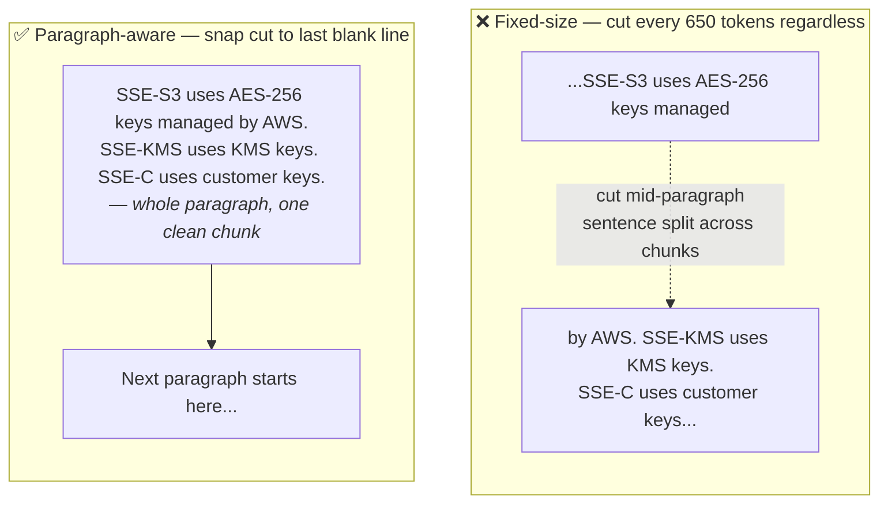
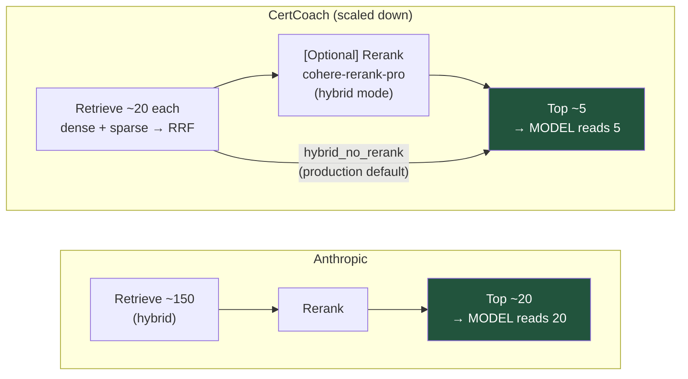

# Chunking & Chunk-Count — Deep Dive

> Companion note to [`architecture.md`](./architecture.md) §2. Expands one sentence:
>
> *"Paragraph-aware chunking (~650 tokens, with 100-token overlap). Slide a 650-token window and
> snap cuts to the last `\n{2,}` paragraph boundary within the window (if it leaves ≥50 tokens).
> Overlap (~15%) prevents a boundary-straddling answer from being cut in half. Anthropic's testing
> found retrieving ~20 chunks beat 5 or 10 — which is why the candidate pool is deep and an
> optional reranker (or RRF ordering directly) trims later."*

There are **three separate decisions** packed into that sentence. This doc takes them one at a
time: (1) how big a chunk is and where you cut it, (2) why chunks overlap, and (3) how many
chunks you pull back at query time.

---

## 0. First: what is a "chunk", and why not just embed whole documents?

A **chunk** is the unit of retrieval. We don't embed a whole 40-page whitepaper as one vector —
we split it into pieces, embed each piece, and store them. At query time we retrieve *chunks*,
not documents.

Why split at all? Because an embedding squashes a whole passage into **one fixed-size vector**.
The more text you cram in, the more that vector becomes a *blurry average* of many topics, and
the specific fact you care about gets diluted. Two failure modes sit at the extremes:

| Chunk too **big** | Chunk too **small** |
|---|---|
| Vector is a blurry average of many topics → the exact fact is diluted → weaker match | Fact is fragmented across pieces → no single chunk is a complete answer |
| Retrieving it drags in lots of irrelevant text → wastes the model's context, hurts precision | More chunks to store/index; more boundary-straddle risk |

`~500–800 tokens` (roughly a few paragraphs) is the sweet spot: big enough to be a coherent,
self-contained idea; small enough to stay *about one thing* so its vector is sharp. This isn't a
magic number — **it's one of the axes the eval harness sweeps** (architecture.md §5, "chunk size"),
so the final value is measured, not guessed.

---

## 1. Paragraph-aware chunking — cut on paragraph breaks, not on a byte count

The naive approach is **fixed-size chunking**: walk the document and cut every N tokens. It's
trivial to implement and it's *wrong* for structured docs, because the cut lands wherever the
counter happens to hit — mid-sentence, mid-table, or right between a heading and the content it
introduces.

**Paragraph-aware chunking** snaps cuts to the nearest `\n{2,}` paragraph break (two or more
blank lines) rather than cutting at an arbitrary token count. The algorithm is:

1. Slide a 650-token window through the document
2. Within the window, find the last `\n{2,}` paragraph break
3. If snapping to that break would leave at least 50 tokens in the chunk, cut there
4. Otherwise cut at the full 650-token boundary

This avoids splitting mid-sentence or mid-paragraph. You only fall back to a hard size-based cut
when a single paragraph is itself longer than the token budget.



In the naive cut, a sentence is split across two chunks — neither chunk has the complete thought,
so both embeddings are weaker. The paragraph-aware cut keeps the paragraph intact so the chunk is
self-describing and its vector is on-topic.

This is also **why ingestion normalises everything to Markdown first** (architecture.md §2, step 1):
Markdown preserves blank lines between paragraphs, which are the boundaries the chunker snaps to.
PDFs can flatten paragraph spacing; the cleaning step (`ingestion/clean.py`) restores consistent
blank-line separation so the chunker has reliable boundaries to work with.

> **Note — the chunker does NOT split on `##` headings.** The split boundary is `\n{2,}` (two or
> more blank lines). A heading followed immediately by body text with no blank line in between stays
> in the same chunk. The 50-token minimum ensures very short paragraphs are not emitted as isolated
> chunks.

---

## 2. Overlap — so a fact on the seam isn't sliced in half

Even when you cut on headings, a long section still gets split by size — and any hard cut can land
in the middle of the one sentence that answers a question. If that happens, **neither** resulting
chunk contains the full fact, so **both** embeddings are incomplete and retrieval either misses it
or returns a fragment.

**Overlap** fixes this by repeating the last ~10–15% of one chunk at the start of the next. A fact
near a boundary then appears *complete* in at least one chunk.

```
Section tokens:   [────────────────── one long section ──────────────────]

Without overlap:  [──── Chunk A ────][──── Chunk B ────]
                                    ↑ a definition that starts in A and
                                      finishes in B is broken in both

With overlap:     [──── Chunk A ────]
                              [──── Chunk B ────]
                              └──┬──┘
                        ~10–15% repeated → the straddling fact
                        is whole inside Chunk B
```

**Concrete case.** Suppose the text reads *"…the maximum size of a single S3 object is **5 TB**."*
and the cut falls right before "5 TB". Without overlap, Chunk A ends at "…is" and Chunk B starts at
"5 TB" with no idea what "5 TB" refers to. Neither chunk answers *"max S3 object size?"* well. With
overlap, Chunk B carries the trailing context ("…single S3 object is 5 TB") and matches cleanly.

**The trade-off** (why ~10–15% and not 50%): overlap duplicates text, which inflates storage and
the index, and can surface the same fact as two near-duplicate hits. A modest overlap buys boundary
safety without much bloat — and RRF (and the optional reranker) downstream absorb the occasional duplicate.

> This pairs with the **retrieve-small-expand-to-context** pattern (architecture.md §2, step 3):
> `neighbor_chunk_ids` let us match a tight chunk and *then* hand the model its neighbors for
> reasoning room. Overlap protects the *seam*; neighbor-expansion restores *breadth* on demand.
> They solve different halves of the same "a chunk is a fragment of a larger whole" problem.

---

## 3. "Retrieving ~20 chunks beat 5 or 10" — what that actually means

This is the part most worth getting precise, because the number **20** plays a *different role* in
Anthropic's finding than it does in the CertCoach pipeline. Getting this right is the difference
between a claim you can defend and one that unravels in a deep-dive.

### What Anthropic actually found

From [Anthropic's Contextual Retrieval post](https://www.anthropic.com/engineering/contextual-retrieval)
(verified against the source):

- *"Passing the top-20 chunks to the model is more effective than just the top-10 or top-5"* — they
  tested 5 / 10 / 20 and found **20 the most performant**.
- Their pipeline retrieves a **large** candidate pool (~150), **reranks** it, and passes the
  **top-20 to the model** for generation.

So in Anthropic's setup, **20 = the number of chunks the model reads**, chosen *after* reranking
from ~150.

### The recall → precision funnel (why "retrieve many, feed few")

The underlying principle is **two-stage retrieval** (architecture.md §3):

- **First stage — maximize recall.** Cast a wide net so the right chunk is *somewhere* in the pool.
  Cheap bi-encoder / BM25 search over the whole corpus. Missing the chunk here is unrecoverable —
  nothing downstream can retrieve what wasn't fetched.
- **Second stage — maximize precision.** A slow, accurate **cross-encoder reranker** re-scores only
  that pool and keeps the best few. It reads full query–document pairs, so it's far more accurate
  than the first-stage vectors — but too slow to run over the whole corpus, which is exactly why it
  only sees the pool.

The lesson from the "20 > 5 or 10" result is directional: **don't starve the model with a naive
top-5; go deeper and let a reranker do the trimming.**

### How CertCoach maps onto it (the honest version)

CertCoach runs the *same shape* at a smaller scale — but the numbers sit in different slots:



| | Candidate pool (pre-rerank) | Passed to the model (post-rerank) |
|---|---|---|
| **Anthropic** | ~150 | **~20** |
| **CertCoach** | **~20** | ~5 |

So the two "20"s are **not the same 20**:

- Anthropic's 20 is *post-rerank, model-facing*.
- CertCoach's 20 is the *pre-rerank candidate pool*; only ~5 reach the model.

That's a deliberate scale-down, justified by three things: cert chunks are short and focused (a good
top-5 is often enough to answer), the 2-week budget favors smaller pools and prompts, and — most
importantly — **`k` and `rerank on/off` are eval-harness axes** (architecture.md §5). The finding
*motivates the architecture* (go deeper than top-5, trim with a reranker); the exact `20 → 5` split
is then confirmed or adjusted by our own numbers, not copied from the blog.

> **If an interviewer pushes:** the correct answer is *"Anthropic's 20 was chunks-to-the-model after
> reranking from ~150; ours is the candidate-pool size feeding a reranker that trims to ~5. Same
> two-stage recall/precision principle, scaled to a short-chunk cert corpus, and the final k is
> whatever our retrieval eval says wins."* That's defensible; "we use 20 because Anthropic said 20"
> is not.

---

## 4. The three decisions, in one table

| Decision | Knob | Why | Failure it prevents |
|---|---|---|---|
| **Where to cut** | snap to last `\n{2,}` paragraph break within 650-token window (≥50 token minimum) | keeps paragraphs intact; avoids mid-sentence cuts | sentence split across two chunks; weaker embeddings |
| **How big** | ~650 tokens | coherent idea, still focused → sharp embedding | too big = diluted vector; too small = fragmented facts |
| **Overlap** | ~100 tokens (~15%) repeated | a fact on the seam stays whole in ≥1 chunk | boundary-straddling answer sliced in half |
| **How many to retrieve** | deep pool (~20) → [optional rerank →] few (~5) | recall first (don't miss it), precision second (don't drown the model) | naive top-5 misses the chunk; feeding 20 raw dilutes the answer |

---

## Sources

- [Anthropic — Introducing Contextual Retrieval](https://www.anthropic.com/engineering/contextual-retrieval)
  — the "top-20 > top-10 > top-5", retrieve-150-then-rerank, and chunk-boundary guidance (verified).
- [Pinecone — Rerankers and Two-Stage Retrieval](https://www.pinecone.io/learn/series/rag/rerankers/)
  — the recall-vs-precision rationale behind "retrieve many, feed few".
- [`architecture.md`](./architecture.md) §2 (ingestion) and §3 (retrieval) — where these choices live.
