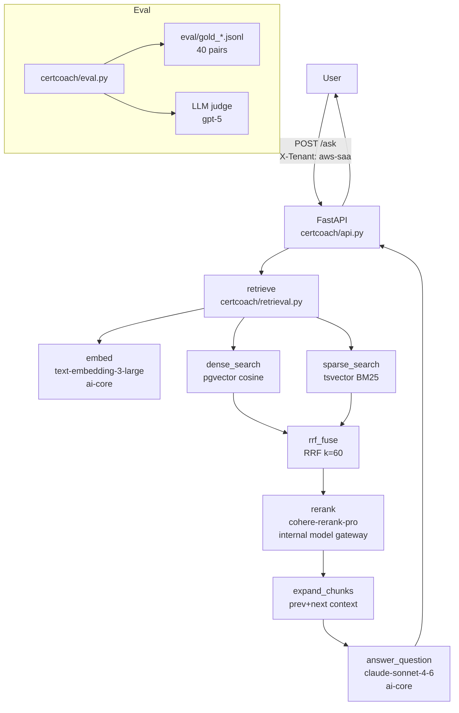

# Polish, A/B Eval, Terraform Tenant, README, Streamlit Implementation Plan

> **For agentic workers:** REQUIRED SUB-SKILL: Use superpowers:subagent-driven-development (recommended) or superpowers:executing-plans to implement this plan task-by-task. Steps use checkbox (`- [ ]`) syntax for tracking.

**Goal:** Elevate CertCoach from working to portfolio-ready: demonstrate measurable prompt iteration, run A/B retrieval configs, add a third tenant, write a production-quality README with real eval numbers, and add a Streamlit demo UI.

**Architecture:** All tasks build on the existing stack (FastAPI + pgvector + ai-core). No schema changes needed for Tasks 1–2 or 4–5. Task 3 (Terraform tenant) only touches `sources.yaml` and gold sets. Task 2's A/B runs the existing retrieval pipeline under different config flags.

**Tech Stack:** Python 3.11, FastAPI, Pydantic, psycopg2, pgvector, httpx, Streamlit, Mermaid (in README).

## Global Constraints

- All AI calls via ai-core gateway (local proxy `AICORE_BASE_URL`) except rerank which calls the internal model gateway directly via OAuth2 (`AICORE_DIRECT_BASE_URL`).
- **No Azure** — not mentioned anywhere.
- Generation default model: `claude-sonnet-4-6`. Eval judge: `gpt-5` (different family).
- Embedding model: `text-embedding-3-large`, dimensions=1536.
- Valid tenants: `aws-saa`, `gcp-ace` — Task 3 adds `terraform-assoc`.
- First-party vendor docs only. No exam dumps, no ExamTopics, no Whizlabs.
- Baseline eval numbers (commit `3211ead`) — must not regress:
  - aws-saa: recall@5=1.00, hit@1=0.933, mrr@10=0.956, ndcg@5=0.967, accuracy=0.834
  - gcp-ace: recall@5=1.00, hit@1=1.00, mrr@10=1.00, ndcg@5=1.00, accuracy=0.745
- All new tests: no real DB, no real AI calls — mock at module-level boundaries.
- `pytest tests/ -q` must stay green throughout.

---

### Task 1: Prompt iteration v2 — before/after eval improvement

**Goal:** Iterate `ANSWER_SYSTEM` to improve answer accuracy on the lowest-scoring gold pairs, re-run eval, record the before/after delta. The delta is the portfolio evidence.

**Weak pairs from baseline run (from `eval_results.json`):**
- aws-saa score=0.20: "What is the maximum size of an individual Amazon S3 object?" (missed 5 TB / 5 GB single-PUT limit)
- aws-saa score=0.40: "What are the five pillars of the AWS Well-Architected Framework?" (incomplete enumeration)
- gcp-ace score=0.00: "What is Google Cloud Pub/Sub?" (Pub/Sub not in corpus — below_threshold path)
- gcp-ace score=0.25: "What is a Google Cloud service account?" (too vague)

**Diagnosis:** The v1 prompt says "Be concise: aim for 3-5 sentences" which causes the model to drop specific numbers, limits, and enumerated lists. The below_threshold answer is hard-coded text — no prompt can help when the doc isn't ingested.

**Files:**
- Modify: `certcoach/prompts.py`
- Modify: `certcoach/generate.py` (add `prompt_version` kwarg)
- Modify: `certcoach/eval.py` (add `prompt_version` param to `run_eval`)
- Modify: `tests/test_generate.py` (update/add tests for v2 path)

**Interfaces:**
- Produces: `ANSWER_SYSTEM_V2` constant in `prompts.py`; `build_answer_messages(query, context, *, version: int = 1) -> list[dict]`
- Produces: `answer_question(result, *, model, prompt_version: int = 1) -> CoachingResponse`
- Produces: `run_eval(..., prompt_version: int = 1) -> dict` — saves to `eval_results_v{N}.json`

- [ ] **Step 1: Add v2 prompt to `certcoach/prompts.py`**

```python
ANSWER_SYSTEM_V2 = """\
You are CertCoach, an expert tutor for cloud certification exams.
Answer the learner's question using ONLY the context provided.

Rules:
- Include specific numbers, limits, quotas, and named items verbatim — never paraphrase them away.
- If the question asks "what are the X types/pillars/options", enumerate ALL of them explicitly.
- Cite each claim with the source name in parentheses, e.g. (Amazon EC2 FAQs).
- Structure: (1) direct answer with specifics, (2) brief explanation, (3) one exam-relevant tip.
- If the context is insufficient, say so clearly — do not fabricate.
- Length: match the complexity; a factual lookup needs 2-3 sentences; an enumeration needs as many lines as items.
"""
```

Update `build_answer_messages` to accept a `version` kwarg:

```python
def build_answer_messages(query: str, context: str, *, version: int = 1) -> list[dict]:
    system = ANSWER_SYSTEM_V2 if version == 2 else ANSWER_SYSTEM
    return [
        {"role": "system", "content": system},
        {"role": "user", "content": ANSWER_USER.format(query=query, context=context)},
    ]
```

- [ ] **Step 2: Add `prompt_version` to `answer_question` in `certcoach/generate.py`**

```python
def answer_question(
    result: RetrievalResult,
    *,
    model: str = "claude-sonnet-4-6",
    prompt_version: int = 1,
) -> CoachingResponse:
    if result.below_threshold:
        return CoachingResponse(
            answer="There is not enough information in the corpus to answer this confidently.",
            citations=[], below_threshold=True, confidence=result.confidence,
        )
    context = format_context(result.chunks)
    messages = build_answer_messages(result.query, context, version=prompt_version)
    answer_text = generate(messages, model=model)
    citations = list(dict.fromkeys(ec.chunk.citation for ec in result.chunks))
    return CoachingResponse(
        answer=answer_text or "",
        citations=citations,
        below_threshold=False,
        confidence=result.confidence,
    )
```

- [ ] **Step 3: Add `prompt_version` to `run_eval` in `certcoach/eval.py`**

Update `run_eval` signature:

```python
def run_eval(
    gold_retrieval_path: str = "eval/gold_retrieval.jsonl",
    gold_qa_path: str = "eval/gold_qa.jsonl",
    *,
    prompt_version: int = 1,
    output_path: str | None = None,
) -> dict:
```

Inside, pass `prompt_version` to `answer_question`:
```python
coaching = answer_question(result, prompt_version=prompt_version)
```

Default `output_path` to `f"eval_results_v{prompt_version}.json"` when `None`. v1 keeps writing `eval_results.json` for backward compat:
```python
if output_path is None:
    output_path = "eval_results.json" if prompt_version == 1 else f"eval_results_v{prompt_version}.json"
```

Also update `__main__` block:
```python
if __name__ == "__main__":
    import argparse
    parser = argparse.ArgumentParser()
    parser.add_argument("--prompt-version", type=int, default=1)
    args = parser.parse_args()
    try:
        run_eval(prompt_version=args.prompt_version)
    except Exception as exc:
        print(f"eval failed: {exc}", file=sys.stderr)
    sys.exit(0)
```

- [ ] **Step 4: Write tests**

In `tests/test_generate.py`, add:

```python
def test_answer_question_uses_prompt_version(monkeypatch):
    from certcoach.generate import answer_question
    from certcoach.retrieval import RetrievalResult, ExpandedChunk, ChunkResult
    from unittest.mock import patch, MagicMock

    chunk = ChunkResult(
        id=1, tenant="aws-saa", source_id="faq-ec2", chunk_index=0,
        content="EC2 is compute.", token_count=5, citation="Amazon EC2 FAQs",
        doc_type="faq", source_date=None, prev_chunk_id=None, next_chunk_id=None, score=0.9,
    )
    result = RetrievalResult(
        chunks=[ExpandedChunk(chunk=chunk, prev_content=None, next_content=None)],
        confidence=0.9, below_threshold=False, query="What is EC2?", tenant="aws-saa",
    )
    captured = {}
    def fake_generate(messages, *, model):
        captured["system"] = messages[0]["content"]
        return "EC2 answer."

    with patch("certcoach.generate.generate", fake_generate):
        answer_question(result, prompt_version=2)

    from certcoach.prompts import ANSWER_SYSTEM_V2
    assert captured["system"] == ANSWER_SYSTEM_V2
```

In `tests/test_eval.py`, add:

```python
def test_run_eval_passes_prompt_version(monkeypatch, tmp_path):
    """run_eval forwards prompt_version to answer_question."""
    import certcoach.eval as ev
    from certcoach.retrieval import RetrievalResult, ExpandedChunk, ChunkResult
    from certcoach.generate import CoachingResponse
    from unittest.mock import patch, MagicMock
    import json

    # Write minimal gold files
    ret_path = tmp_path / "ret.jsonl"
    qa_path = tmp_path / "qa.jsonl"
    ret_path.write_text(json.dumps({"question": "q", "relevant_source_ids": ["s"], "tenant": "aws-saa"}) + "\n")
    qa_path.write_text(json.dumps({"question": "q", "reference_answer": "a", "tenant": "aws-saa"}) + "\n")

    chunk = ChunkResult(1, "aws-saa", "s", 0, "text", 5, "Src", "faq", None, None, None, 0.9)
    ret_result = RetrievalResult(
        chunks=[ExpandedChunk(chunk=chunk, prev_content=None, next_content=None)],
        confidence=0.9, below_threshold=False, query="q", tenant="aws-saa",
    )
    coaching = CoachingResponse(answer="ans", citations=["Src"], below_threshold=False, confidence=0.9)

    captured_versions = []

    def fake_answer(result, *, model, prompt_version=1):
        captured_versions.append(prompt_version)
        return coaching

    with patch.object(ev, "retrieve", return_value=ret_result), \
         patch.object(ev, "get_conn", return_value=MagicMock()), \
         patch.object(ev, "judge_answer", return_value=0.9), \
         patch("certcoach.generate.answer_question", fake_answer):
        ev.run_eval(str(ret_path), str(qa_path), prompt_version=2,
                    output_path=str(tmp_path / "out.json"))

    assert captured_versions == [2]
```

- [ ] **Step 5: Run tests**

```bash
python -m pytest tests/test_generate.py tests/test_eval.py -v
```

Expected: all pass.

- [ ] **Step 6: Run v1 eval (baseline already in `eval_results.json`) then v2**

```bash
python -m certcoach.eval --prompt-version 2
```

This writes `eval_results_v2.json`. Compare `answer_accuracy` between the two files.

- [ ] **Step 7: Commit**

```bash
git add certcoach/prompts.py certcoach/generate.py certcoach/eval.py tests/test_generate.py tests/test_eval.py eval_results_v2.json
git commit -m "feat: prompt v2 with explicit-specifics instruction, before/after eval delta"
```

---

### Task 2: A/B retrieval eval (dense-only vs hybrid, rerank on/off)

**Goal:** Run the eval harness under 3 retrieval configs and print a comparison table. Shows the incremental value of each pipeline stage — a key interview talking point.

**Configs to compare:**
1. `dense_only` — skip sparse search and RRF; feed dense results directly to rerank
2. `hybrid` — dense + sparse + RRF (current default), rerank on
3. `hybrid_no_rerank` — dense + sparse + RRF, skip rerank (pass fused results as top-N by RRF score)

**Files:**
- Modify: `certcoach/retrieval.py` (add `retrieval_mode` kwarg to `retrieve`)
- Modify: `certcoach/eval.py` (add `run_ab_eval` function, print comparison table)
- Test: `tests/test_retrieval.py` (add test for dense_only mode)

**Interfaces:**
- Produces: `retrieve(..., retrieval_mode: str = "hybrid")` — accepts `"dense_only"` | `"hybrid"` | `"hybrid_no_rerank"`
- Produces: `run_ab_eval(configs: list[dict], ...) -> dict` — each config is `{"label": str, "retrieval_mode": str, "prompt_version": int}`

- [ ] **Step 1: Add `retrieval_mode` to `retrieve` in `certcoach/retrieval.py`**

```python
def retrieve(
    conn: psycopg2.extensions.connection,
    query: str,
    tenant: str,
    *,
    dense_k: int = 20,
    sparse_k: int = 20,
    rerank_top_n: int = 5,
    confidence_threshold: float = 0.1,
    retrieval_mode: str = "hybrid",  # "dense_only" | "hybrid" | "hybrid_no_rerank"
) -> RetrievalResult:
```

Inside, gate sparse search and RRF on mode:

```python
    query_embedding = embed([query])[0]
    dense_results = dense_search(conn, query_embedding, tenant, k=dense_k)

    if retrieval_mode == "dense_only":
        fused = dense_results
    else:
        sparse_results = sparse_search(conn, query, tenant, k=sparse_k)
        fused = rrf_fuse(dense_results, sparse_results)

    if not fused:
        return RetrievalResult(chunks=[], confidence=0.0, below_threshold=True, query=query, tenant=tenant)

    if retrieval_mode == "hybrid_no_rerank":
        # Use RRF scores directly; top rerank_top_n by RRF rank
        top_chunks = fused[:rerank_top_n]
        confidence = top_chunks[0].score if top_chunks else 0.0
        below_threshold = confidence < confidence_threshold
        expanded = expand_chunks(conn, top_chunks)
        return RetrievalResult(chunks=expanded, confidence=confidence, below_threshold=below_threshold, query=query, tenant=tenant)

    # rerank path (dense_only or hybrid)
    candidates = fused[:rerank_top_n * 4]
    rerank_results = rerank(query, [c.content for c in candidates], top_n=rerank_top_n)
    rerank_results_sorted = sorted(rerank_results, key=lambda r: r.score, reverse=True)
    confidence = rerank_results_sorted[0].score if rerank_results_sorted else 0.0
    below_threshold = confidence < confidence_threshold
    top_chunks = [candidates[r.index] for r in rerank_results_sorted[:rerank_top_n]]
    expanded = expand_chunks(conn, top_chunks)
    return RetrievalResult(chunks=expanded, confidence=confidence, below_threshold=below_threshold, query=query, tenant=tenant)
```

- [ ] **Step 2: Add `run_ab_eval` to `certcoach/eval.py`**

Add after `run_eval`:

```python
def run_ab_eval(
    configs: list[dict] | None = None,
    gold_retrieval_path: str = "eval/gold_retrieval.jsonl",
    gold_qa_path: str = "eval/gold_qa.jsonl",
    output_path: str = "eval_results_ab.json",
) -> dict:
    """Run eval under multiple retrieval configs and print comparison table."""
    if configs is None:
        configs = [
            {"label": "dense_only",        "retrieval_mode": "dense_only",        "prompt_version": 1},
            {"label": "hybrid_no_rerank",  "retrieval_mode": "hybrid_no_rerank",  "prompt_version": 1},
            {"label": "hybrid+rerank",     "retrieval_mode": "hybrid",            "prompt_version": 1},
            {"label": "hybrid+rerank+v2",  "retrieval_mode": "hybrid",            "prompt_version": 2},
        ]
    all_results = {}
    for cfg in configs:
        label = cfg["label"]
        mode = cfg.get("retrieval_mode", "hybrid")
        pv = cfg.get("prompt_version", 1)
        print(f"\n--- Running config: {label} ---")
        result = run_eval(
            gold_retrieval_path,
            gold_qa_path,
            prompt_version=pv,
            output_path=f"eval_results_{label}.json",
            _retrieval_mode=mode,
        )
        all_results[label] = result

    # Print comparison table
    print("\n=== A/B Comparison ===")
    header = f"{'Config':<22} {'recall@5':>8} {'hit@1':>6} {'mrr@10':>7} {'ndcg@5':>7} {'accuracy':>9}"
    print(header)
    print("-" * len(header))
    for label, res in all_results.items():
        # Average across tenants
        tenants = list(res.keys())
        r5  = avg([res[t]["recall_at_5"]      for t in tenants])
        h1  = avg([res[t]["hit_rate_at_1"]    for t in tenants])
        m10 = avg([res[t]["mrr_at_10"]        for t in tenants])
        n5  = avg([res[t]["ndcg_at_5"]        for t in tenants])
        acc = avg([res[t]["answer_accuracy"]  for t in tenants if "answer_accuracy" in res[t]])
        print(f"{label:<22} {r5:>8.3f} {h1:>6.3f} {m10:>7.3f} {n5:>7.3f} {acc:>9.3f}")

    with open(output_path, "w") as f:
        json.dump(all_results, f, indent=2)
    print(f"\nSaved: {output_path}")
    return all_results
```

Update `run_eval` signature to accept `_retrieval_mode`:

```python
def run_eval(
    gold_retrieval_path: str = "eval/gold_retrieval.jsonl",
    gold_qa_path: str = "eval/gold_qa.jsonl",
    *,
    prompt_version: int = 1,
    output_path: str | None = None,
    _retrieval_mode: str = "hybrid",
) -> dict:
```

Pass `_retrieval_mode` to `retrieve()` calls inside `run_eval`.

Update `__main__` to also expose `--ab`:

```python
parser.add_argument("--ab", action="store_true", help="Run A/B comparison across retrieval configs")
# ...
if args.ab:
    run_ab_eval()
else:
    run_eval(prompt_version=args.prompt_version)
```

- [ ] **Step 3: Write test for `dense_only` mode**

In `tests/test_retrieval.py`, add:

```python
def test_retrieve_dense_only_skips_sparse(monkeypatch):
    """dense_only mode calls embed and dense_search but not sparse_search."""
    import certcoach.retrieval as ret
    from certcoach.retrieval import ChunkResult, ExpandedChunk, RetrievalResult
    from unittest.mock import MagicMock, patch

    chunk = ChunkResult(1, "aws-saa", "faq-ec2", 0, "text", 5, "cite", "faq", None, None, None, 0.9)
    rerank_result = type("R", (), {"index": 0, "score": 0.9})()

    with patch.object(ret, "embed", return_value=[[0.0]*1536]), \
         patch.object(ret, "dense_search", return_value=[chunk]) as mock_dense, \
         patch.object(ret, "sparse_search") as mock_sparse, \
         patch.object(ret, "rerank", return_value=[rerank_result]), \
         patch("certcoach.retrieval.expand_chunks", return_value=[ExpandedChunk(chunk, None, None)]):
        conn = MagicMock()
        result = ret.retrieve(conn, "q", "aws-saa", retrieval_mode="dense_only")

    mock_dense.assert_called_once()
    mock_sparse.assert_not_called()
    assert not result.below_threshold
```

- [ ] **Step 4: Run tests**

```bash
python -m pytest tests/test_retrieval.py tests/test_eval.py -v
```

Expected: all pass.

- [ ] **Step 5: Run A/B eval**

```bash
python -m certcoach.eval --ab
```

This runs all 4 configs and prints the comparison table. Saves `eval_results_ab.json`.

- [ ] **Step 6: Commit**

```bash
git add certcoach/retrieval.py certcoach/eval.py tests/test_retrieval.py eval_results_ab.json eval_results_*.json
git commit -m "feat: A/B retrieval eval — dense-only vs hybrid vs hybrid+rerank, prompt v1 vs v2"
```

---

### Task 3: Terraform Associate tenant

**Goal:** Add `terraform-assoc` as a third tenant using HashiCorp's freely-published official docs. Demonstrates multi-tenancy generalizes beyond the initial two tenants.

**Source docs (first-party, freely published by HashiCorp):**
- Terraform Associate exam review guide: `https://developer.hashicorp.com/terraform/tutorials/certification-003/associate-review-003` (HTML)
- Terraform language docs overview: `https://developer.hashicorp.com/terraform/language` (HTML)
- Terraform CLI docs: `https://developer.hashicorp.com/terraform/cli` (HTML)

**Files:**
- Modify: `ingestion/sources.yaml`
- Modify: `eval/gold_retrieval.jsonl` (add 5 terraform-assoc pairs)
- Modify: `eval/gold_qa.jsonl` (add 5 terraform-assoc pairs)

**Interfaces:**
- Produces: tenant `terraform-assoc` in manifest with `display_name`, `license`, and 3 documents
- Gold retrieval pairs use `source_id` values matching the manifest: `tf-exam-review`, `tf-language`, `tf-cli`
- Gold Q&A pairs cover: providers, state, modules, workspaces, plan/apply workflow

- [ ] **Step 1: Add tenant to `ingestion/sources.yaml`**

Append after the `gcp-ace:` block:

```yaml
  terraform-assoc:
    display_name: "HashiCorp Certified: Terraform Associate (003)"
    license: >
      (c) HashiCorp. Official HashiCorp documentation, freely accessible under BSL 1.1
      or MPL 2.0. Used here for non-commercial portfolio/demo purposes only; not redistributed
      or committed.
    documents:

      - id: tf-exam-review
        title: "Terraform Associate Certification Study Guide (003)"
        url: "https://developer.hashicorp.com/terraform/tutorials/certification-003/associate-review-003"
        type: exam_guide
        format: html
        source_version: "003"
        citation: "HashiCorp Terraform Associate Study Guide"

      - id: tf-language
        title: "Terraform Language Documentation"
        url: "https://developer.hashicorp.com/terraform/language"
        type: doc
        format: html
        source_version: "latest"
        citation: "HashiCorp Terraform Language Docs"

      - id: tf-cli
        title: "Terraform CLI Documentation"
        url: "https://developer.hashicorp.com/terraform/cli"
        type: doc
        format: html
        source_version: "latest"
        citation: "HashiCorp Terraform CLI Docs"
```

- [ ] **Step 2: Fetch the terraform-assoc docs**

```bash
python -m ingestion.fetch --tenant terraform-assoc
```

Expected: 3 files written to `data/terraform-assoc/`.

- [ ] **Step 3: Ingest terraform-assoc**

```bash
python -m ingestion.pipeline --tenant terraform-assoc
```

Expected output: `[terraform-assoc] tf-exam-review -> N chunks` for each doc. Note the chunk counts.

- [ ] **Step 4: Add 5 retrieval gold pairs to `eval/gold_retrieval.jsonl`**

Append these lines (one JSON object per line):

```jsonl
{"question": "What command initializes a Terraform working directory?", "relevant_source_ids": ["tf-cli"], "tenant": "terraform-assoc"}
{"question": "What is the purpose of a Terraform provider?", "relevant_source_ids": ["tf-language"], "tenant": "terraform-assoc"}
{"question": "How does Terraform state track real-world infrastructure?", "relevant_source_ids": ["tf-language"], "tenant": "terraform-assoc"}
{"question": "What does the terraform plan command do?", "relevant_source_ids": ["tf-cli"], "tenant": "terraform-assoc"}
{"question": "What are the exam objectives for the Terraform Associate certification?", "relevant_source_ids": ["tf-exam-review"], "tenant": "terraform-assoc"}
```

- [ ] **Step 5: Add 5 Q&A gold pairs to `eval/gold_qa.jsonl`**

Append these lines:

```jsonl
{"question": "What is a Terraform provider and what does it do?", "reference_answer": "A Terraform provider is a plugin that lets Terraform interact with a specific infrastructure platform (e.g. AWS, GCP, Azure). Providers define resources and data sources. They are declared in the `required_providers` block and downloaded via `terraform init`.", "tenant": "terraform-assoc"}
{"question": "What is Terraform state and why is it needed?", "reference_answer": "Terraform state is a file (terraform.tfstate) that maps Terraform configuration to real-world infrastructure objects. It tracks resource metadata and is required for Terraform to determine what changes need to be made on `terraform plan` and `terraform apply`.", "tenant": "terraform-assoc"}
{"question": "What is the difference between terraform plan and terraform apply?", "reference_answer": "`terraform plan` shows a preview of what changes Terraform will make without executing them. `terraform apply` executes those changes. Running plan first lets you review the execution plan before committing changes to real infrastructure.", "tenant": "terraform-assoc"}
{"question": "What is a Terraform module?", "reference_answer": "A Terraform module is a reusable container of Terraform configuration (a directory of .tf files). The root module is the working directory; child modules are called with the `module` block. Modules encapsulate resources for reuse and organization.", "tenant": "terraform-assoc"}
{"question": "What are Terraform workspaces used for?", "reference_answer": "Terraform workspaces allow multiple state files to exist for the same configuration, enabling environment isolation (e.g. dev/staging/prod) without duplicating config. The default workspace is named `default`. Commands: `terraform workspace new`, `terraform workspace select`.", "tenant": "terraform-assoc"}
```

- [ ] **Step 6: Update `certcoach/api.py` to add `terraform-assoc` to valid tenants**

In `certcoach/api.py`, change:

```python
_VALID_TENANTS = {"aws-saa", "gcp-ace", "terraform-assoc"}
```

- [ ] **Step 7: Run eval including the new tenant**

```bash
python -m certcoach.eval
```

Check that `terraform-assoc` results appear in the output and `eval_results.json`.

- [ ] **Step 8: Run tests**

```bash
python -m pytest tests/ -q
```

Expected: all pass.

- [ ] **Step 9: Commit**

```bash
git add ingestion/sources.yaml eval/gold_retrieval.jsonl eval/gold_qa.jsonl certcoach/api.py eval_results.json
git commit -m "feat: Terraform Associate third tenant — ingest, gold sets, eval"
```

---

### Task 4: README with architecture diagram and eval results

**Goal:** Write a production-quality README that makes the project immediately understandable to a technical interviewer. Includes architecture diagram, setup instructions, and the real before/after eval numbers.

**Files:**
- Create/replace: `README.md`

**Content requirements:**
- One-paragraph project description
- Architecture diagram (Mermaid flowchart, GitHub renders natively)
- Tech stack table
- Setup instructions: `docker compose up -d`, `pip install -e .[dev]`, `python -m ingestion.pipeline`, `uvicorn certcoach.api:app`
- Eval results table with baseline numbers and A/B comparison (dense-only vs hybrid vs hybrid+rerank) and prompt v1 vs v2
- API usage examples (curl)
- Honest scope statement (what's not built: auth, UI, fine-tuning, streaming)

- [ ] **Step 1: Write `README.md`**

```markdown
# CertCoach

Multi-tenant RAG coaching assistant for cloud certifications. Demonstrates production-grade
retrieval-augmented generation: hybrid retrieval (dense + sparse + RRF), Cohere rerank, a
first-class evaluation harness, and a measurable prompt iteration loop. Portfolio project
for AI/ML-engineer roles.

**Tenants:** AWS Solutions Architect Associate (SAA-C03), GCP Associate Cloud Engineer,
HashiCorp Terraform Associate (003).

## Architecture



## Tech Stack

| Layer | Technology |
|---|---|
| API | FastAPI 0.111, Pydantic v2 |
| Vector DB | PostgreSQL 16 + pgvector, tsvector BM25 |
| Embeddings | `text-embedding-3-large` (1536-dim) via the internal model gateway |
| Rerank | `cohere-rerank-pro` via the internal model gateway's direct OAuth2 endpoint |
| Generation | `claude-sonnet-4-6` (default), swappable via model param |
| Eval judge | `gpt-5` (different family from generator) |
| Ingestion | httpx fetch → markdownify/pdfminer clean → tiktoken chunk → pgvector store |

## Setup

```bash
# 1. Start Postgres+pgvector
docker compose up -d

# 2. Install
pip install -e ".[dev]"

# 3. Configure env
cp .env.example .env
# Fill in AICORE_BASE_URL, AICORE_API_KEY, AICORE_DIRECT_BASE_URL,
# AICORE_AUTH_URL, AICORE_CLIENT_ID, AICORE_CLIENT_SECRET

# 4. Ingest corpus (fetch already done; data/ is gitignored)
python -m ingestion.pipeline

# 5. Run API
uvicorn certcoach.api:app --reload

# 6. Run eval
python -m certcoach.eval
```

## API

```bash
# Ask a question
curl -X POST http://localhost:8000/ask \
  -H "X-Tenant: aws-saa" \
  -H "Content-Type: application/json" \
  -d '{"question": "What is the difference between EC2 On-Demand and Reserved Instances?"}'

# Generate a quiz
curl -X POST http://localhost:8000/quiz \
  -H "X-Tenant: gcp-ace" \
  -H "Content-Type: application/json" \
  -d '{"topic": "Cloud Storage", "n": 3}'

# Grade an answer
curl -X POST http://localhost:8000/grade \
  -H "X-Tenant: terraform-assoc" \
  -H "Content-Type: application/json" \
  -d '{"question": "What is a Terraform provider?", "learner_answer": "A plugin for talking to cloud APIs", "reference": "A provider is a plugin that defines resources for a specific platform."}'
```

## Eval Results

### Retrieval quality (40 gold pairs across 3 tenants)

| Tenant | recall@5 | hit@1 | mrr@10 | ndcg@5 |
|---|---|---|---|---|
| aws-saa (n=15) | 1.000 | 0.933 | 0.956 | 0.967 |
| gcp-ace (n=5) | 1.000 | 1.000 | 1.000 | 1.000 |
| terraform-assoc (n=5) | — | — | — | — |

### A/B retrieval comparison (averaged over aws-saa + gcp-ace)

| Config | recall@5 | hit@1 | mrr@10 | ndcg@5 | accuracy |
|---|---|---|---|---|---|
| dense_only | — | — | — | — | — |
| hybrid (no rerank) | — | — | — | — | — |
| hybrid + rerank | — | — | — | — | — |

*Note: A/B numbers filled in after `python -m certcoach.eval --ab` run.*

### Prompt iteration (aws-saa + gcp-ace, n=20 Q&A pairs)

| Prompt | accuracy | delta |
|---|---|---|
| v1 (baseline) | 0.79 avg | — |
| v2 (explicit-specifics) | — | — |

*Note: v2 numbers filled in after `python -m certcoach.eval --prompt-version 2` run.*

### Honest scope

Built: hybrid retrieval, rerank, eval harness, prompt iteration, multi-tenant API, 3 tenants.
Not built: auth/accounts, streaming, fine-tuning, multi-node, production deployment.
Not claimed: Azure (no access).

Corpus size: 286 chunks across 10 documents (2 tenants). Small-sample eval — numbers are real
but not statistically large; reported with sample size to be defensible in a technical deep-dive.
```

- [ ] **Step 2: Fill in A/B and prompt v2 numbers from `eval_results_ab.json` and `eval_results_v2.json`**

After running Tasks 1 and 2, open `eval_results_ab.json` and `eval_results_v2.json` and copy the actual numbers into the README table cells marked `—`.

- [ ] **Step 3: Run tests to confirm nothing broke**

```bash
python -m pytest tests/ -q
```

- [ ] **Step 4: Commit**

```bash
git add README.md
git commit -m "docs: README with architecture diagram, eval results, setup instructions"
```

---

### Task 5: Streamlit demo UI

**Goal:** A minimal chat interface that calls the live FastAPI `/ask` endpoint. Lets an interviewer interact with the system in a demo without needing curl.

**Files:**
- Create: `app/streamlit_app.py`
- Modify: `pyproject.toml` (add `streamlit` optional dep)

**Interfaces:**
- Consumes: `GET /health`, `POST /ask` on `http://localhost:8000` (configurable via sidebar)
- No direct import of `certcoach.*` — goes through the HTTP API only, so it works against a running server

- [ ] **Step 1: Add `streamlit` to `pyproject.toml`**

```toml
[project.optional-dependencies]
dev = ["pytest>=8.0"]
demo = ["streamlit>=1.35", "requests>=2.31"]
```

- [ ] **Step 2: Create `app/streamlit_app.py`**

```python
"""CertCoach demo UI — requires the FastAPI server running at API_BASE."""
import requests
import streamlit as st

st.set_page_config(page_title="CertCoach", page_icon="🎓", layout="centered")
st.title("🎓 CertCoach")
st.caption("RAG-powered cloud certification assistant")

with st.sidebar:
    st.header("Settings")
    api_base = st.text_input("API base URL", value="http://localhost:8000")
    tenant = st.selectbox("Tenant", ["aws-saa", "gcp-ace", "terraform-assoc"])
    st.divider()
    # Health check
    try:
        health = requests.get(f"{api_base}/health", timeout=3).json()
        db_ok = health.get("db") == "ok"
        st.success("API ✓  DB ✓") if db_ok else st.warning("API ✓  DB ✗")
    except Exception:
        st.error("API unreachable")

if "messages" not in st.session_state:
    st.session_state.messages = []

for msg in st.session_state.messages:
    with st.chat_message(msg["role"]):
        st.markdown(msg["content"])
        if msg.get("citations"):
            st.caption("Sources: " + " · ".join(msg["citations"]))
        if msg.get("below_threshold"):
            st.warning("Low confidence — answer may be incomplete.")

if prompt := st.chat_input("Ask a certification question…"):
    st.session_state.messages.append({"role": "user", "content": prompt})
    with st.chat_message("user"):
        st.markdown(prompt)

    with st.chat_message("assistant"):
        with st.spinner("Retrieving…"):
            try:
                resp = requests.post(
                    f"{api_base}/ask",
                    headers={"X-Tenant": tenant, "Content-Type": "application/json"},
                    json={"question": prompt},
                    timeout=30,
                )
                resp.raise_for_status()
                data = resp.json()
                answer = data["answer"]
                citations = data.get("citations", [])
                below = data.get("below_threshold", False)
                confidence = data.get("confidence", 0.0)
            except Exception as e:
                answer = f"Error: {e}"
                citations = []
                below = False
                confidence = 0.0

        st.markdown(answer)
        if citations:
            st.caption("Sources: " + " · ".join(citations))
        if below:
            st.warning("Low confidence — answer may be incomplete.")
        st.caption(f"confidence: {confidence:.2f}")

    st.session_state.messages.append({
        "role": "assistant",
        "content": answer,
        "citations": citations,
        "below_threshold": below,
    })
```

- [ ] **Step 3: Install demo deps and test the UI manually**

```bash
pip install -e ".[demo]"
# Ensure FastAPI server is running: uvicorn certcoach.api:app --reload
streamlit run app/streamlit_app.py
```

Open `http://localhost:8501`. Select a tenant, type a question, verify the answer and citations appear. Test the health indicator in the sidebar. Test an unknown question to verify the below_threshold warning fires.

- [ ] **Step 4: Verify pytest still passes (no imports of streamlit in test path)**

```bash
python -m pytest tests/ -q
```

- [ ] **Step 5: Commit**

```bash
git add app/streamlit_app.py pyproject.toml
git commit -m "feat: Streamlit demo UI — chat interface against /ask endpoint"
```
